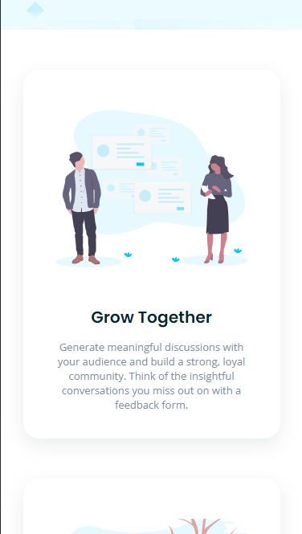

# Frontend Mentor - Huddle landing page with alternating feature blocks solution

This is a solution to the [Huddle landing page with alternating feature blocks challenge on Frontend Mentor](https://www.frontendmentor.io/challenges/huddle-landing-page-with-alternating-feature-blocks-5ca5f5981e82137ec91a5100). Frontend Mentor challenges help you improve your coding skills by building realistic projects.

## Table of contents

- [Overview](#overview)
  - [The challenge](#the-challenge)
  - [Screenshot](#screenshot)
  - [Links](#links)
- [My process](#my-process)
  - [Built with](#built-with)
  - [What I learned](#what-i-learned)
  - [Continued development](#continued-development)
  - [Useful resources](#useful-resources)
- [Author](#author)

## Overview

### The challenge

Users should be able to:

- View the optimal layout for the site depending on their device's screen size
- See hover states for all interactive elements on the page

### Screenshot





### Links

- Solution URL: [Solution URL](https://www.frontendmentor.io/solutions/flexbox-responsive-huddle-landing-page-alternate-feature-blocks-T0fLSScSGj)
- Live Site URL: [Live Site URL](https://triii3.github.io/huddle-landing-page/)

## My process

### Built with

- Semantic HTML5 markup
- CSS3
- Flexbox
- Mobile-first workflow

### What I learned

```html
<h1>Some HTML code I'm proud of</h1>
```

```css
.subscribe {
  position: relative;
  top: 60px;
}
```

by using the 'position: relative;' and 'top' attribute we are able to position the subscribe section to have that half background-color effect from footer without disturbing the flow elements too much

```css
#logo-footer {
  filter: brightness(0) invert(1);
}
```

turns the image the white

```css
html,
body {
  height: 100%;
}
```

this snippet helped me with the copyright part get its position at the flex-end by having its parent div have their height declared

### Continued development

I would like to continue focusing more on better dimension judgement when it comes to the different elements inside the webpage. As well as, further developing the variety HTML semantics and correct CSS attributes to use in different scenarios

### Useful resources

- [Hex to CSS Filter](https://isotropic.co/tool/hex-color-to-css-filter/) - This helped me with turning the social media icons turn to pink since I initially used the filter attribute to turn the icons white.

## Author

- GitHub Profile - [Triii](https://github.com/Triii3)
- Frontend Mentor - [@Triii3](https://www.frontendmentor.io/profile/Triii3)
- Twitter - [@TriiiCodes](https://twitter.com/TriiiCodes)
